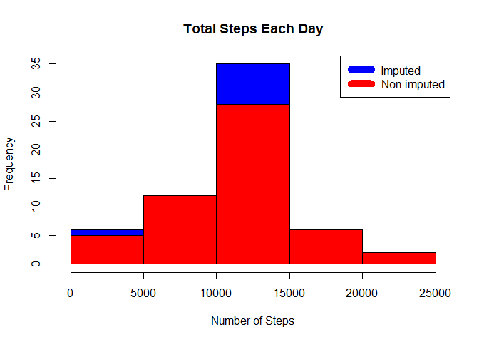

```r
library(ggplot2)
library(scales)
library(Hmisc)
```

```
## Warning: package 'Hmisc' was built under R version 3.4.4
```

```
## Loading required package: lattice
```

```
## Loading required package: survival
```

```
## Loading required package: Formula
```

```
## 
## Attaching package: 'Hmisc'
```

```
## The following objects are masked from 'package:base':
## 
##     format.pval, units
```

```r
library(htmltools)
```

```
## Warning: package 'htmltools' was built under R version 3.4.4
```

```r
library(htmlwidgets)
```

```
## Warning: package 'htmlwidgets' was built under R version 3.4.4
```

##A. Loading and preprocessing the data
####Show any code that is needed to load the data (i.e. read.csv()). Process/transform the data (if necessary) into a format suitable for your analysisLoading and preprocessing the data

### 1a. Download the data

```r
if(!file.exists('activity.csv')){
  download.file("https://d396qusza40orc.cloudfront.net/repdata%2Fdata%2Factivity.zip", destfile="activity.zip")
unzip("activity.zip")
#debug(utils:::unpackPkgZip)
}
```
###1b. Load the data using read.csv()

```r
activity_data <- read.csv('activity.csv')
head(activity_data)
```

```
##   steps       date interval
## 1    NA 2012-10-01        0
## 2    NA 2012-10-01        5
## 3    NA 2012-10-01       10
## 4    NA 2012-10-01       15
## 5    NA 2012-10-01       20
## 6    NA 2012-10-01       25
```
###2. Process/transform the data (if necessary) into a format suitable for your analysis
#Date and interval reformatting

```r
activity_data$date <- as.POSIXct(activity_data$date)
activity_data$steps <- as.numeric(activity_data$steps)
```

#####Remove rows containing missing values and save the results to a new subsetted data frame “activity_data_nonmissing”. The full, original dataset is not deleted because it is needed for imputation in a future step.

```r
activity_data_nonmissing <- subset(activity_data, !is.na(activity_data$steps))
head(activity_data_nonmissing)
```

```
##     steps       date interval
## 289     0 2012-10-02        0
## 290     0 2012-10-02        5
## 291     0 2012-10-02       10
## 292     0 2012-10-02       15
## 293     0 2012-10-02       20
## 294     0 2012-10-02       25
```

-----

##B. What is mean total number of steps taken per day?

```r
Steps_By_Day<- tapply(activity_data$steps, activity_data$date, sum)
head(Steps_By_Day)
```

```
## 2012-10-01 2012-10-02 2012-10-03 2012-10-04 2012-10-05 2012-10-06 
##         NA        126      11352      12116      13294      15420
```

###1. Make a histogram of the total number of steps taken each day

```r
#hist(Steps_By_Day$steps, main = paste("Total Steps By Day"), col="blue", xlab="Total Number of Steps")

hist(Steps_By_Day, xlab = "Total Number of Steps", col="blue", main = "Histogram of Total Steps By Day")
```

<!-- -->

###2. Calculate and report the mean and median total number of steps taken per day

```r
Steps_By_DayMean <- mean(Steps_By_Day, na.rm = TRUE)
Steps_By_DayMedian <- median(Steps_By_Day, na.rm = TRUE)

print(Steps_By_DayMean)
```

```
## [1] 10766.19
```

```r
print(Steps_By_DayMedian)
```

```
## [1] 10765
```
* The Mean per day is 10766.19 steps
* The Median per day is: 10765 steps

-----

##C. What is the average daily activity pattern?

```r
averageStepsPerInterval <- aggregate(x=list(meanSteps=activity_data$steps), by=list(interval=activity_data$interval), FUN=mean, na.rm=TRUE)

steps_by_interval <- aggregate(steps ~ interval, activity_data, mean)
```


###1. Make a time series plot

```r
ggplot(data=averageStepsPerInterval, aes(x=interval, y=meanSteps)) +
    geom_line() +
    xlab("5-minute interval") +
    ylab("average number of steps taken") 
```

<!-- -->

###2. Which 5-minute interval, on average across all the days in the dataset, contains the maximum number of steps?

```r
mostSteps <- which.max(averageStepsPerInterval$meanSteps)

IntervalMostSteps<- averageStepsPerInterval[mostSteps,'interval']

IntervalMostSteps 
```

```
## [1] 835
```

```r
#The most steps were [1] at interval 835
```

* Most Steps at: `Interval 835`


----

##D. Imputing missing values
###1. Calculate and report the total number of missing values in the dataset 

```r
TotalMissingValues <- length(which(is.na(activity_data$steps)))
TotalMissingValues 
```

```
## [1] 2304
```

```r
#[1] 2304
```

* Number of missing values: `2304`

###2. Devise a strategy for filling in all of the missing values in the dataset: For this assignment, the average for each interval was inserted for each missing value. I imputed "0" for the initial day on 10-01-2012 because there was no prior interval and this was the starting point of the rising trend in the data.
###3. Create a new dataset that is equal to the original dataset but with the missing data filled in.

```r
activity_dataImputed<- activity_data
activity_dataImputed$steps <- impute(activity_data$steps, fun = mean)
activity_dataImputed[as.character(activity_dataImputed$date) == "2012-10-01", 1] <- 0


head(activity_dataImputed)
```

```
##   steps       date interval
## 1     0 2012-10-01        0
## 2     0 2012-10-01        5
## 3     0 2012-10-01       10
## 4     0 2012-10-01       15
## 5     0 2012-10-01       20
## 6     0 2012-10-01       25
```


###4a. Make a histogram of the total number of steps taken each day 

```r
Steps_By_DayImputed <- tapply(activity_dataImputed$steps, activity_dataImputed$date, sum)

Steps_By_Day_Recalc <- aggregate(steps ~ date, activity_dataImputed, sum)
hist(Steps_By_Day_Recalc$steps, main = paste("Total Steps Each Day"), col="blue", xlab="Number of Steps")

Steps_By_Day_df<- as.data.frame(aggregate(steps ~ date, activity_data, sum))
Steps_By_Day_Recalc_df <- as.data.frame(aggregate(steps ~ date, activity_dataImputed, sum))
#Create Histogram to show difference. 
hist(Steps_By_Day_df$steps, main = paste("Total Steps Each Day"), col="red", xlab="Number of Steps", add=T)
legend("topright", c("Imputed", "Non-imputed"), col=c("blue", "red"), lwd=10)
```

<!-- -->

###4b. Report the mean and median total number of steps taken per day. Do these values differ from the estimates from the first part of the assignment? What is the impact of imputing missing data on the estimates of the total daily number of steps?. 

```r
Steps_By_DayMeanImputed <- mean(Steps_By_DayImputed)
Steps_By_DayMedianImputed <- median(Steps_By_DayImputed)
Steps_By_DayMeanImputed
```

```
## [1] 10589.69
```

```r
#10589.69
Steps_By_DayMedianImputed
```

```
## [1] 10766.19
```

```r
#10766.19
#Determining the difference between imputed and non-imputed data.

mean_diff <- Steps_By_DayMeanImputed - Steps_By_DayMean
med_diff <- Steps_By_DayMedianImputed - Steps_By_DayMedian
steps_diff <- sum(Steps_By_Day_Recalc$steps) - sum(Steps_By_Day_df$steps)

mean_diff 
```

```
## [1] -176.4949
```

```r
med_diff
```

```
## [1] 1.188679
```

```r
steps_diff
```

```
## [1] 75363.32
```

The mean of the imputed data is 10589.69.
The median of the imputed data is 10766.19.
The difference between the original (e.g., non-imputed) mean and the recalculated imputed mean is -176.4949
The difference between the original (e.g., non-imputed) mean and recalculated imputed mean is 1.188679
The difference between total number of steps the original (non-imputed) data and the imputed data is 75363.32, meaning that there were 75363.32 more steps in the imputed data.


* Mean (Imputed): 10589.69
* Median (Imputed):  10766.19
* Difference in Mean-Imputed Mean: -176.4949
* Difference in Median-Imputed Median: 1.188679
* Total Difference in steps: 75363.32


----

## E.Are there differences in activity patterns between weekdays and weekends? 
###1. Create a new factor variable in the dataset with two levels – “weekday” and “weekend” indicating whether a given date is a weekday or weekend day. For this part the weekdays() function may be of some help here. Use the dataset with the filled-in missing values for this part.


```r
activity_dataImputed$dateType <-  ifelse(as.POSIXlt(activity_dataImputed$date)$wday %in% c(0,6), 'weekend', 'weekday')
head(activity_dataImputed$dateType)
```

```
## [1] "weekday" "weekday" "weekday" "weekday" "weekday" "weekday"
```

###2. Make a panel plot containing a time series plot


```r
averagedactivity_dataImputed <- aggregate(steps ~ interval + dateType, data=activity_dataImputed, mean)
ggplot(averagedactivity_dataImputed, aes(interval, steps)) + 
    geom_line() + 
    facet_grid(dateType ~ .) +
    xlab("5-minute interval") + 
    ylab("average number of steps")
```

<!-- -->
The main differences in activity between weekends and weekdays is that activity peaks earlier on weekdays, but there is a trend toward more overall activity on weekends.
